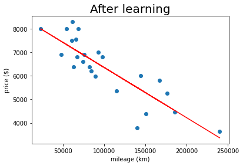

<div id="top"></div>
<p align=center>
  
  
  
</p>

<!-- PROJECT LOGO -->
<br />
<div align="center" style="height:200px; margin-bottom:10%">
  <a>
    
  </a>
</div>

<!-- TABLE OF CONTENTS -->
<summary>Table of Contents</summary>
<ol>
<li>
	<a href="#about-the-project">About The Project</a>
	<ul>
	<li><a href="#built-with">Built With</a></li>
	</ul>
</li>
<li>
	<a href="#getting-started">Getting Started</a>
	<ul>
	<li><a href="#prerequisites">Prerequisites</a></li>
	<li><a href="#installation">Installation</a></li>
	</ul>
</li>
<li><a href="#usage">Usage</a></li>
<li><a href="#roadmap">Roadmap</a></li>
<li><a href="#contact">Contact</a></li>
<li><a href="#acknowledgments">Acknowledgments</a></li>
</ol>
</details>

<!-- ABOUT THE PROJECT -->
## About the project

<div align="center" style="height:200px; margin-bottom:10%">
  <a>
    
  </a>
</div>
<!-- TODO Put images from the project here -->

ft_linear_regression is a 42 project, aiming to code a [linear regression](https://en.wikipedia.org/wiki/Linear_regression) algorithm, it is an introduction to machine learning.

This is a very basic program, but it is also a way to discover the various concepts of Machine Learning.

You can find complete subject <a href="docs/">here</a>.

### Built With

* <a href="https://jupyter.org/" target="_blank" title="Jupyter's website">C</a>

<!-- GETTING STARTED -->
## Getting Started

### Prerequisites

* [python3](https://www.python.org/)
* [jupyter](https://jupyter.org/)
* [numpy](https://numpy.org/)
* [Matplotlib](https://matplotlib.org/)

### Installation

1. Clone the repo

   ```sh
   git clone https://github.com/kema-dev/ft_linear_regression.git
   ```

<!-- USAGE EXAMPLES -->
## Usage

1. Just open any notebook (located in <a href="src/">src/</a>) and run it !

<!-- ROADMAP -->
## Roadmap

* This project is finished and no further work is planned on it

See the [open issues](https://github.com/kema-dev/ft_linear_regression/issues) for a full list of proposed features (and known issues).

<!-- CONTACT -->
## Contact

kema-dev - [GitHub](https://github.com/kema-dev)

## Acknowledgments

* [Img Shields](https://shields.io)
* [README.MD-Template](https://github.com/othneildrew/Best-README-Template)
